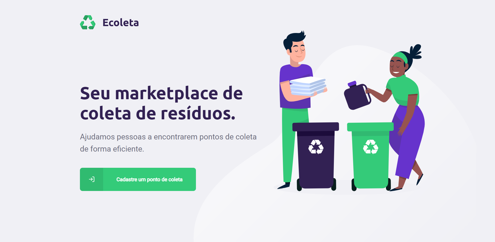
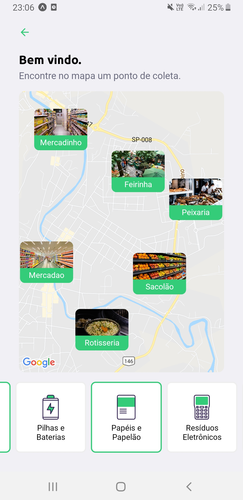
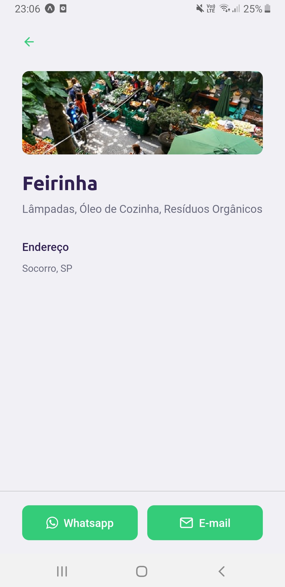

<h1  align="center">

</h1>

<h2 align="center">Sumário</h2>

<a  href="#bulb-projeto">:bulb: Projeto</a>&nbsp;&nbsp;&nbsp;|&nbsp;&nbsp;&nbsp;
<a  href="#pencil-tecnologias"> :pencil: Tecnologias</a>&nbsp;&nbsp;&nbsp;|&nbsp;&nbsp;&nbsp;
<a  href="#heart-preview">:heart: Preview</a>&nbsp;&nbsp;&nbsp;|&nbsp;&nbsp;&nbsp;
<a  href="#rocket-getting-started">:rocket: Getting Started</a>&nbsp;&nbsp;&nbsp;|&nbsp;&nbsp;&nbsp;
<a  href="#trophy-conclusão">:trophy: Conclusão </a>

## :bulb: Projeto

<b>Ecoleta</b> foi a aplicação desenvolvida pela [Rocketseat](https://rocketseat.com.br/), com o propósito de compartilhar com a comunidade, gratuitamente, a aplicação de diversas tecnologias, na construção de uma API com a temática de meio ambiente, visto o evento ser realizado durante a Semana Mundial do Meio Ambiente (1° de Jun - 5 de Jun).

Com esta API, pontos de coletas de resíduos serão conectados com os cidadãos, facilitando o processo de reciclagem, consequentemente ajudando a preserver o meio ambiente.

## :pencil: Tecnologias

**:satellite: API**

- [NodeJs;](https://nodejs.org/en/)

- [TypeScript;](https://www.typescriptlang.org/)

- [Express;](https://www.express.com/)

**:computer: Web**

- [React Js;](https://pt-br.reactjs.org/)

- [TypeScript;](https://www.typescriptlang.org/)

- [Axios.](https://github.com/axios/axios)

**:iphone: Mobile**

- [React Native;](https://facebook.github.io/react-native/)

- [TypeScript;](https://www.typescriptlang.org/)

- [Expo;](https://expo.io/)

- [Axios;](https://github.com/axios/axios)

## :heart: Preview

 

 

## :rocket: Getting Started

Para rodar o projeto na sua máquina, o primeiro passo é executar o seguinte comando no seu terminal `$ git clone https://github.com/navarroleonardo/next-level-week-01.git`. 

Após clonar o repositório na sua máquina, ainda pelo terminal, entre em cada uma das três subpastas, e execute o comando `npm install` para que todas as dependências do projeto sejam instaladas.

Este processo ficará assim:

`cd server`
`npm install`
`cd ../web`
`npm install`
`cd ../mobile`
`npm install`

### :satellite: Iniciando a API

Com as dependências já instaladas, acesse a subpasta server, e execute o comando `npm run knex:migrate` para criar as tabelas no banco de dados sqlite, e em sequência execute `npm run knex:seed` para alimentar a tabela 'items' com os itens que poderão ser coletados pelos pontos de coletas.

Pronto, a API está pronta para ser iniciada. Para isso, basta executar o comando `npm run dev` para que o servidor começe a rodar na porta 3333.

> **Atenção** é necessário estar com o servidor rodando para conseguirmos executar os próximos passos corretamente.

### :computer: Iniciando o sistema Web

Navegue para a subpasta web e execute o comando `npm start`. Uma janela será aberta no seu navegador, assim que o sistema for iniciado. Pronto, agora você já consegue cadastrar os pontos de coleta :smile:

### :iphone: Iniciando o sistema Mobile

> Para utilizar o sistema mobile, será necessária a instalação do aplicativo Expo no seu smartphone.

Para rodar o sistema, navegue para a subpasta mobile e execute o comando `npm start`. Uma nova janela será aberta no seu navegador padrão. Quando o QR Code for carregado, abra a camera do seu celular, escaneie o código, e você será direcionado para o Expo app. Com isso, você já será capaz de filtrar os pontos de coleta cadastrados, primeiramente pela localidade (UF e Cidade), e posteriormente pelos itens coletados.

## :trophy: Conclusão

Esse evento foi muito bom para ter o primeiro contato com tecnologias muito interessantes, como TypeScript, React, Axios e Expo.

Consegui perceber a forma como o TypeScript e o React são capazes de nos ajudar, transformando o processo de desenvolvimento muito mais prático e cauteloso.

Fiquei impressionado com a praticidade que o Expo tem para nos possibilitar rodar projetos em nossos smartphones, e ainda mais impressionado com as requisições que podemos fazer, utilizando a biblioteca Axios, consultando tanto as APIs externas, como fizemos ao buscar UFs e Municípios da [API do IBGE](https://servicodados.ibge.gov.br/api/docs/localidades?versao=1#api-Municipios-estadosUFMunicipiosGet), quanto APIs internas, no caso consultando os itens do nosso bd.

Foi muito bom para mim abrir essas novas portas. Com certeza eu continuarei estudando para conseguir melhorar o meu nível de conhecimento nestas tecnologias, e conseguir utilizá-las de forma eficaz e eficiente dentro dos futuros projetos.

--- 

<h5 align="center"> 🚀 Ecoleta by Leonardo Navarro :heart: </h5>

---